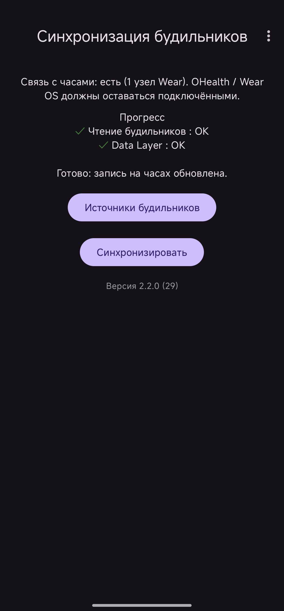
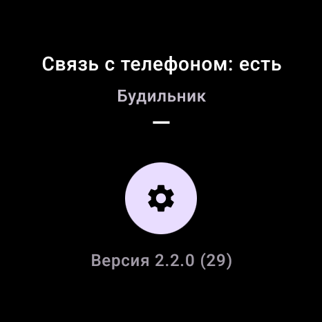
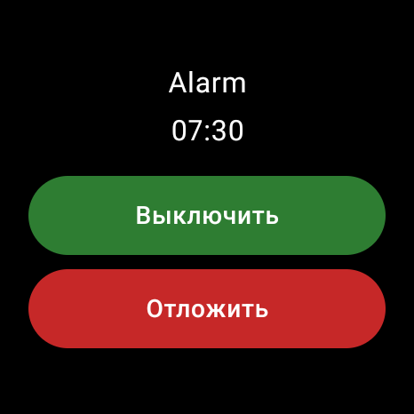

# Wear Alarm Sync

**[Русская версия / Russian version](README.ru.md)**

Sync your phone's next system alarm to a Wear OS watch and ring it on the watch. Dismiss or snooze from the watch — the action is forwarded to the phone's Clock app.

**Current version:** 2.2.2 (versionCode 31)

## What it does

- Reads the **next system alarm** from the phone (`AlarmManager.getNextAlarmClock()`).
- Sends it to the watch over the **Google Wearable Data Layer** (requires an existing phone ↔ watch link via OHealth / Wear OS).
- On the watch, schedules a local alarm and shows a full-screen alarm UI with vibration.
- **Dismiss** and **Snooze** on the watch are relayed to the phone.
- Optional: **suppress alarm when the watch is off-body** (requires body sensors permission).
- Customizable **vibration pattern** on the watch (synced from the phone).

## Screenshots

| Phone | Watch | Alarm on watch |
|-------|-------|----------------|
|  |  |  |

## Architecture

Single universal APK for both phone and watch (`com.wearalarmsync`):

| Module | Role |
|--------|------|
| **core** | Shared constants (`WearSync`): Data Layer paths, keys, DISMISS/SNOOZE commands |
| **app** | Phone + watch logic in one module |

**Entry point:** `LauncherActivity` detects the device type (`FEATURE_WATCH`) and opens either `PhoneMainActivity` or `WearMainActivity`.

**Phone:** reads next alarm, pushes to Data Layer, listens for dismiss/snooze commands from the watch.

**Watch:** listens to Data Layer, schedules alarms (`AlarmScheduler`), shows `AlarmActivity`, keeps process alive via `AlarmKeepAliveService` (needed on some OEM watches such as OPLUS).

## Requirements

- Android 8.0+ (API 26+), target SDK 35
- Phone and watch paired via **OHealth / Wear OS**
- **The same signed APK** installed on both devices
- Google Play services on both devices
- **Exact alarm** permission on the watch (Android 12+)
- **Notifications** and **full-screen intent** permission on the watch

## Installation

1. Build or download the APK (see [Building](#building)).
2. Install the **same APK** on your phone and watch (sideload via `adb install` or file manager).
3. Open the app on the phone and tap **Sync**.
4. On the watch, grant exact-alarm, notification, and (optionally) body-sensor permissions when prompted.

## Building

Place `icon.jpg` in the project root (used to generate the launcher icon before each build).

### Debug APK

```bash
# Windows
gradlew.bat collectApks

# Linux / macOS
./gradlew collectApks
```

Output: `build/apk/debug/wear-alarm-sync-universal-debug.apk`

Any `:app:assembleDebug` build also copies the APK to `build/apk/debug/` automatically.

### Release APK

1. Copy `keystore.properties.example` → `keystore.properties` and fill in your signing credentials.
2. Run:

```bash
gradlew.bat syncReleaseApks   # Windows
./gradlew syncReleaseApks     # Linux / macOS
```

Output: `build/apk/release/wear-alarm-sync-universal-release.apk`

### Building without a local Android SDK (Docker)

If you don't have the Android SDK installed, build inside a container instead:

```bash
docker build -t wear-alarm-sync-build .
docker run --rm -v "${PWD}/build:/workspace/build" wear-alarm-sync-build
```

Output: `build/apk/debug/wear-alarm-sync-universal-debug.apk`. See comments in `Dockerfile` for the release-build variant.

## GitHub release pipeline

CI builds a signed release APK and publishes a [GitHub Release](https://docs.github.com/en/repositories/releasing-projects-on-github) when you push a version tag.

### 1. Create a GitHub repository

```bash
git init
git add .
git commit -m "Initial commit"
gh repo create wear-alarm-sync --public --source=. --push
```

Or create an empty repo on GitHub and push manually:

```bash
git remote add origin https://github.com/YOUR_USER/wear-alarm-sync.git
git branch -M main
git push -u origin main
```

### 2. Add signing secrets

In the repo: **Settings → Secrets and variables → Actions → New repository secret**.

| Secret | Value |
|--------|--------|
| `KEYSTORE_BASE64` | Base64-encoded `.jks` / `.keystore` file |
| `KEYSTORE_PASSWORD` | Keystore password |
| `KEY_ALIAS` | Key alias |
| `KEY_PASSWORD` | Key password |

Encode the keystore (Linux / macOS / Git Bash):

```bash
base64 -w0 release.keystore
```

Windows PowerShell:

```powershell
[Convert]::ToBase64String([IO.File]::ReadAllBytes("release.keystore"))
```

Create a keystore if you do not have one:

```bash
keytool -genkeypair -v -keystore release.keystore -alias wearalarmsync -keyalg RSA -keysize 2048 -validity 10000
```

### 3. Publish a release

Bump `versionCode` and `versionName` in `app/build.gradle.kts`, commit, then tag and push:

```bash
git tag v2.1.14
git push origin v2.1.14
```

The workflow [`.github/workflows/release.yml`](.github/workflows/release.yml) will:

1. Build `wear-alarm-sync-universal-release.apk`
2. Attach it to a GitHub Release for that tag

**Manual build** (no release): **Actions → Release → Run workflow** — the APK is saved as a workflow artifact.

### Other Gradle tasks

| Task | Description |
|------|-------------|
| `collectApks` | Build debug APK → `build/apk/debug/` |
| `syncDebugApks` | Same as above |
| `syncReleaseApks` | Build signed release APK → `build/apk/release/` |
| `syncAllApks` | Debug + release |

## Usage

### Phone

- Shows connection status to the watch and the next system alarm time.
- Tap **Sync** after changing alarms in the Clock app, or when the watch shows no data yet.
- Menu (⋮) → **Alarm vibration** — adjust intensity, pulse length, and gap; settings sync to the watch.

### Watch

- Shows connection status and the next synced alarm time.
- Settings icon → vibration options and **Do not alarm when watch is off-body** (disabled by default).
- When the alarm fires: full-screen UI with Dismiss / Snooze buttons.

## Limitations

- Only the **next** system alarm is available (Android API limitation).
- Dismiss/snooze behavior depends on the phone's Clock app.
- Off-body suppression requires a compatible sensor; if data is unavailable, the alarm **will** ring (fail-safe).
- The universal APK includes Wear Compose libraries on the phone, so the phone APK is larger than a phone-only build would be.

## Project structure

```
project4/
├── app/                  # Universal APK (phone + watch)
├── core/                 # Shared WearSync constants
├── build/apk/            # Collected APK output (debug / release)
├── scripts/              # deploy-all.ps1 and helpers
├── icon.jpg              # Source for launcher icon (required for build)
└── keystore.properties   # Release signing (gitignored)
```

## Development

- **Deploy script (Windows):** `scripts/deploy-all.ps1` — builds debug APK, installs on all connected `adb` devices, sets a test alarm on the phone, and launches the app.
- **Version bump:** update `versionCode` (+1) and `versionName` in `app/build.gradle.kts` before each release.

## License

This project is licensed under the **Personal Use Only License** — see [LICENSE](LICENSE).

You may use, modify, and run the software **only for personal, private, non-commercial purposes**. **Commercial use and sale are not permitted.** You may share copies free of charge for private use only, provided the license is included.
